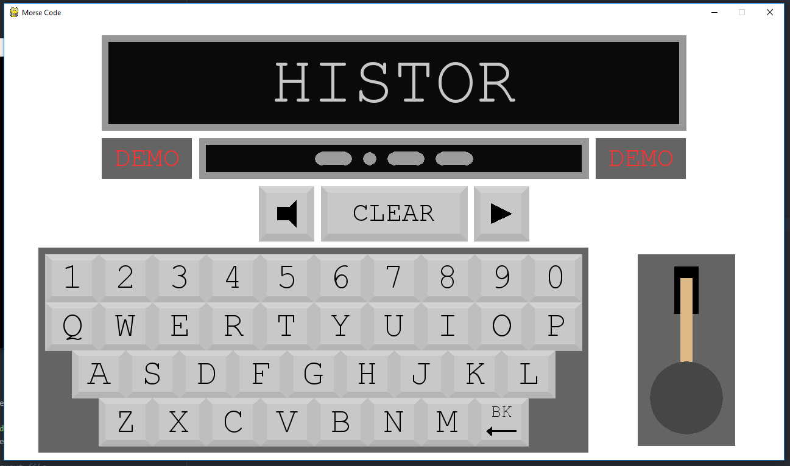

# MorsecodeGUI
a morse code gui made for a scout thing

Designed to run on a raspberry pi, unknown screen size so everything is just based on fractions of the screen and an assumed standard aspect ratio of 16:9 (although it has been tested on everything from 3:4(standard, looks a little dodgy) to 21:9(ultrawide))

Here's it running in demo mode (after having been left idle for x amount of time)

## Features currently in there:
- On screen keyboard and morse code key
- On screen visualisation of current morse code
- Translation of code into english
- Physical mouse/keyboard integration
- Physical morse code key integration (on Raspberry Pi only)
- Sound when the on screen, physical, or keyboard key is pressed
- A demo mode that types out predetermined words after x amount of idle time
- Error handling for both user modification of config.py and during runtime
- A clear button to remove all text from the screen
- An on screen way to mute the sounds

## Features still to add:
- Playback to hear what you've typed
- Auto-update (a call to check this repo on start to check that it's the latest version)

## How To:

### Set up the physical morse code key to a Raspberry Pi:

plug it in, wire it up, go go go.

Still writing this bit, check back later. Who knows maybe it'll have a fancy picture one day.

### Close the program:
There's a word called `exitword` in 'config.py'. Type it to close the program.
If you don't want it to be the default of `quit` (because people might type it accidentally), feel free to change it to something else.

Hitting escape also closes the program if the `escapetoclose` value in 'config.py' is `True`. Set it to `False` (case sensitive) to disable

### Change the colours:
All colours are represented in the 'config.py' file, inside parentheses with an rgb format, and look like this: `(126,255,0)` Each number represents the red, green, and blue values of a colour in that order, and can be any number in the range from 0 to 255 (inclusive).

For example, `(255,0,0)` would be pure red, as the red value is at its maximum, and blue and green are at their minimum.
Feel free to change any colours you see like that to make it look as pretty as you want.

### Change the demo behaviour
There's a list of words called `demowords` in 'config.py' that are randomly chosen to type out by the program in demo mode.
Feel free to add/subtract your own words to this list to make it fit the theme of what you're going for.

Just ensure that all words are inside quotations `"like this"` or `'like this'` but not `'like this"` `"or this'`

There's also a number right next to`demowords` called `demotime`, which is simply the number of seconds that the program has to be left alone to begin cycling through words. Feel free to change this as well.
To turn off demo mode completely just delete all the words in `demowords`, so it looks like this: `demowords = []` and demo mode will never begin.
